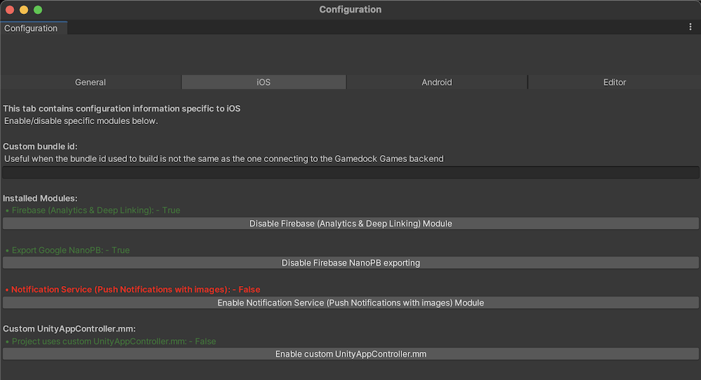

# Upgrade to Unity SDK 5.2.x

> [!NOTE]
> Since Gamedock SDK version 5.2.x, we are using Unity Package Manager (UPM) to manage the SDK.

### Remove existing Gamedock assets

Close Unity Editor, goto project directory and remove followings:

* Assets/Gamedock
* Assets/GamedockSDKiOSConfig.asset
* Assets/Resources/Gamedock
* Assets/Plugins/Newtonsoft.Json.dll
* Assets/Plugins/ios/GCIdentity.h
* Assets/Plugins/ios/GCIdentity.mm
* Assets/Plugins/ios/GamedockAppController.h
* Assets/Plugins/ios/GamedockAppController.mm
* Assets/Plugins/ios/Gamedock.framework

### Integrating SDK via UPM

Update Packages/manifest.json to add scope registries and dependencies:

~~~json
{
 "scopedRegistries": [
   ......
   {
     "name": "Azerion",
     "url": "http://registry.npmjs.com",
     "scopes": [
       "com.azerion",
       "com.azerion.gamedock-sdk-unity"
     ]
   }
   .......
 ],
 "dependencies": {
   .......
   "com.azerion.gamedock-sdk-unity": "5.2.0-preview.2",
   .......
 }
}
~~~

> [!NOTE]
> Use the latest Gamedock SDK version available here https://www.npmjs.com/package/com.azerion.gamedock-sdk-unity.

> [!TIP]
> Scope registries can also be added from Unity Editor [Edit > Project Settings > Package Manager]

### Unity Editor inspection
Open Unity Editor

#### Check GamedockSDK gameobject
Check if all the values are properly set in the Inspector window. Bundle Id unity field might be empty after SDK update.

#### Check Gamedock SDK Configuration
Go to the Azerion > Gamedock SDK > Configuration. Make sure the fields are configured correctly. If not, fix configuration and press the ‘Create default configuration files’ button. Browse all the tabs and Enable/Disable modules according to your preference.

### Dependency management
For dependency resolution use External Dependency Manager for Unity (EDM4U)

#### iOS dependency
Configure iOS resolver settings from Assets > External Dependency Manager > iOS Resolver > Settings 
* Check the *Enable Swift Framework Support Workaround* 
* Leave the *Swift Framework Version* blank

#### Android dependency
Go to Project Settings > Publishing Settings 
* **Enable** *Custom Main Gradle Template* option to add mainTemplate.gradle 
* **Enable** *Custom Gradle Properties Template* option to add gradleTemplate.properties

Configure Android resolver settings from Assets > External Dependency Manager > Android Resolver > Settings 
* **Enable** - Patch mainTemplate.gradle
* **Enable** - Use Jetifier
* **Disable** - Patch gradleTemplate.properties

Resolve Android dependencies from Assets > External Dependency Manager > Android Resolver > Resolve 