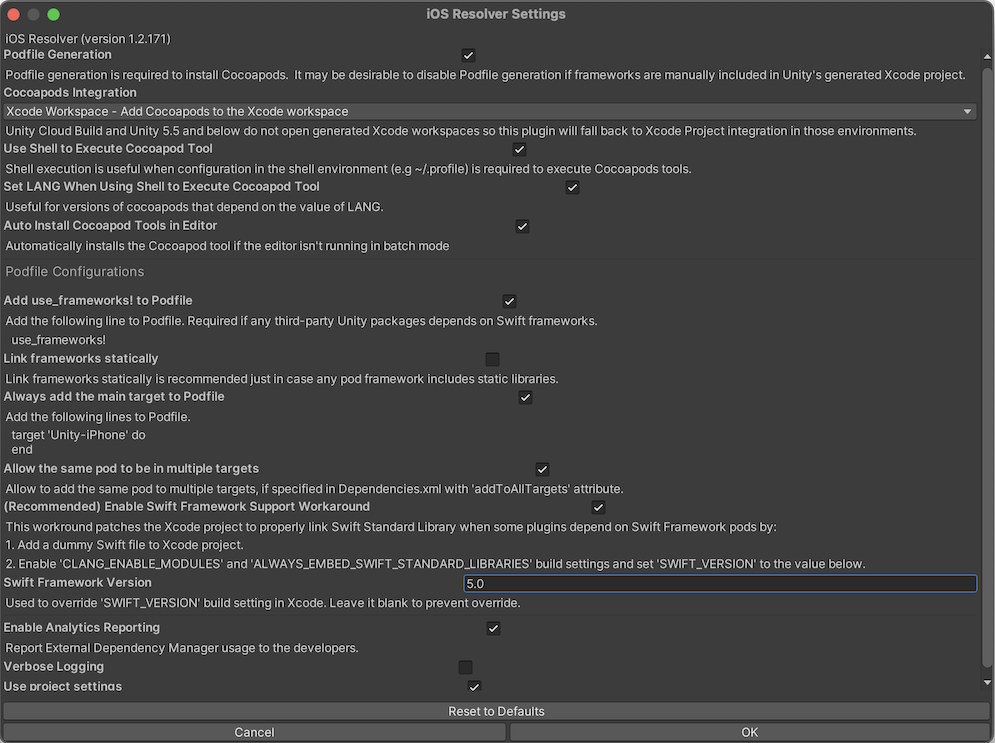
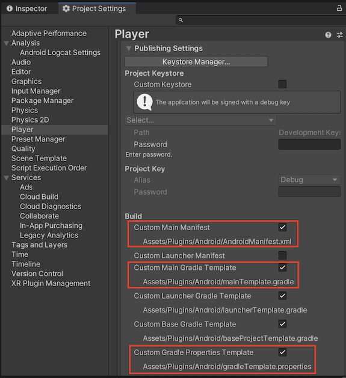
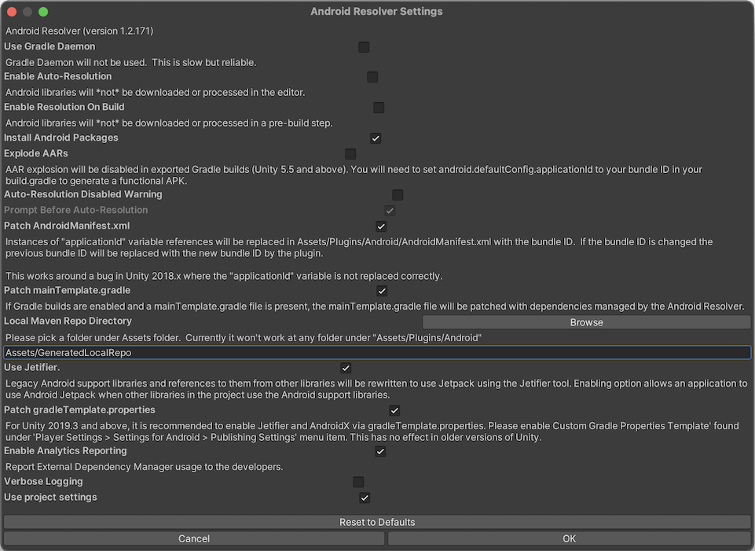
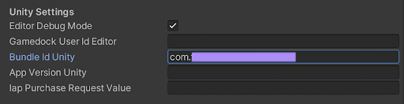
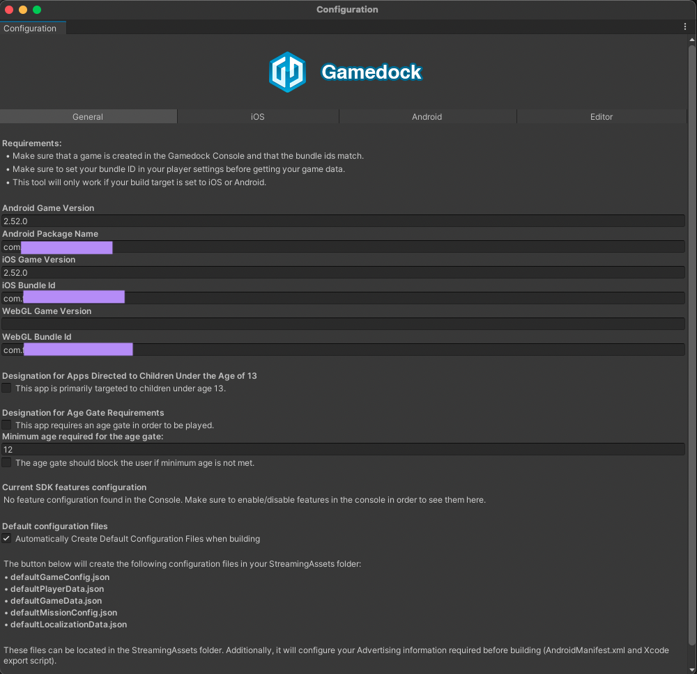
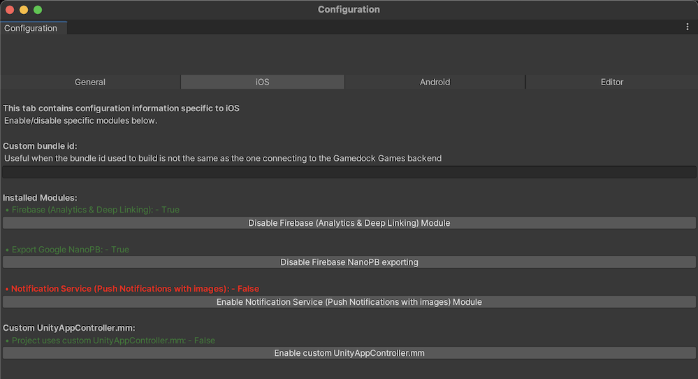
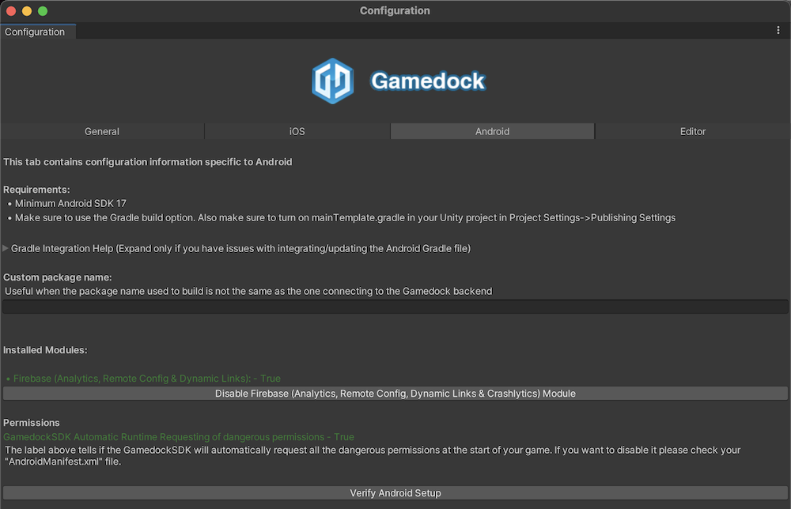
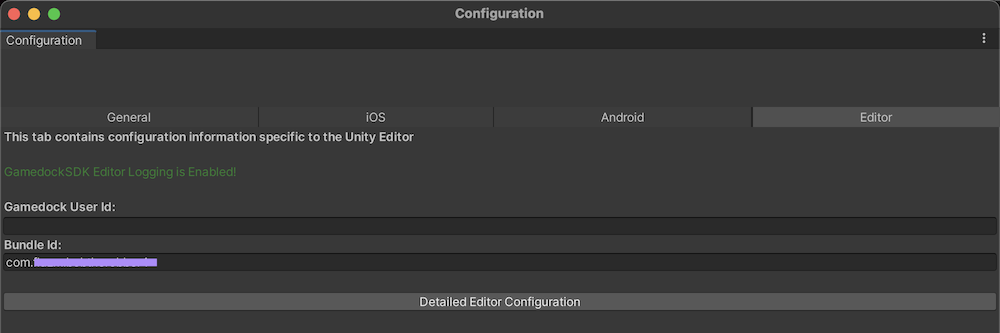

# Upgrade to Unity SDK 5.2.x

> [!NOTE]
> Since Gamedock SDK version 5.2.x, we are using Unity Package Manager (UPM) to manage the SDK.

### Remove existing Gamedock assets

Close Unity Editor, goto project directory and remove followings:

* Assets/Gamedock
* Assets/GamedockSDKiOSConfig.asset
* Assets/Resources/Gamedock
* Assets/Plugins/Newtonsoft.Json.dll
* Assets/Plugins/ios/GCIdentity.h
* Assets/Plugins/ios/GCIdentity.mm
* Assets/Plugins/ios/GamedockAppController.h
* Assets/Plugins/ios/GamedockAppController.mm
* Assets/Plugins/ios/Gamedock.framework

### Remove existing Gamedock dependencies
Remove following lines from Assets/Plugins/Android/mainTemplate.gradle or just delete the 'mainTemplate.gradle' file if you are not managing it manually.  
~~~java

repositories { /* Gamedock Dependency */
	mavenCentral() /* Gamedock Dependency */
	google() /* Gamedock Dependency */
	maven { /* Gamedock Dependency */
		url 'https://maven.google.com/' /* Gamedock Dependency */
		name 'Google' /* Gamedock Dependency */
	} /* Gamedock Dependency */
} /* Gamedock Dependency */

dependencies {
  ....
    implementation 'androidx.multidex:multidex:x.x.x' /* Gamedock Dependency */
    implementation 'androidx.appcompat:appcompat:x.x.x' /* Gamedock Dependency */
    implementation 'androidx.recyclerview:recyclerview:x.x.x' /* Gamedock Dependency */
    implementation 'androidx.cardview:cardview:x.x.x' /* Gamedock Dependency */
    implementation 'com.google.android.gms:play-services-analytics:x.x.x' /* Gamedock Dependency */
    implementation 'com.google.android.gms:play-services-basement:x.x.x' /* Gamedock Dependency */
    implementation 'com.google.android.gms:play-services-games:x.x.x' /* Gamedock Dependency */
    implementation 'com.google.android.gms:play-services-auth:x.x.x' /* Gamedock Dependency */
    implementation 'com.google.android.gms:play-services-drive:x.x.x' /* Gamedock Dependency */
    implementation 'com.google.android.gms:play-services-nearby:x.x.x' /* Gamedock Dependency */
    implementation 'io.reactivex.rxjava2:rxandroid:x.x.x' /* Gamedock Dependency */
    implementation 'io.reactivex.rxjava2:rxjava:x.x.x' /* Gamedock Dependency */
    implementation 'com.google.code.gson:gson:x.x.x' /* Gamedock Dependency */
    implementation 'com.squareup.picasso:picasso:x.x.x' /* Gamedock Dependency */
    implementation 'com.android.billingclient:billing:x.x.x' /* Gamedock Dependency */

    implementation 'io.gamedock.sdk:gamedock-sdk:x.x.x' /* Gamedock Main Module */

    implementation 'com.google.firebase:firebase-analytics:x.x.x' /* Gamedock Firebase */
    implementation 'com.google.firebase:firebase-crashlytics:x.x.x' /* Gamedock Firebase */
    implementation 'com.google.firebase:firebase-crashlytics-ndk:x.x.x' /* Gamedock Firebase */
    implementation 'com.google.firebase:firebase-messaging:x.x.x' /* Gamedock Firebase */
    implementation 'com.google.firebase:firebase-dynamic-links:x.x.x' /* Gamedock Firebase */
    implementation 'com.google.firebase:firebase-config:x.x.x' /* Gamedock Firebase */
  ....
}  

android {	
  ....
    dexOptions { /* Gamedock Dependency */
      javaMaxHeapSize '4g' /* Gamedock Dependency */
    } /* Gamedock Dependency */
  ....

    defaultConfig {
  ....    
      multiDexEnabled true /* Gamedock Dependency */
  ....
    }

}
~~~

Remove followings from Assets/Plugins/Android/gradleTemplate.properties or just delete the 'gradleTemplate.properties' file if you are not managing it manually.
~~~java
....
android.useAndroidX=true
android.enableJetifier=true
....
~~~

Remove followings from Assets/Plugins/Android/AndroidManifest.xml
~~~xml
<manifest>
  <application>
  ....
    <provider android:name="com.google.firebase.provider.FirebaseInitProvider" android:authorities="${applicationId}.firebaseinitprovider" tools:node="remove" />
    <service android:name="io.gamedock.sdk.utils.gcm.GCMListenerService" android:exported="false">
      <intent-filter>
        <action android:name="com.google.firebase.MESSAGING_EVENT" />
      </intent-filter>
    </service>
  ....
  </application>
</manifest>
~~~

### Integrate SDK via UPM

Update Packages/manifest.json to add scope registries and dependencies:

~~~json
{
 "scopedRegistries": [
   ......
   {
     "name": "Azerion",
     "url": "http://registry.npmjs.com",
     "scopes": [
       "com.azerion",
       "com.azerion.gamedock-sdk-unity"
     ]
   }
   .......
 ],
 "dependencies": {
   .......
   "com.azerion.gamedock-sdk-unity": "5.2.0-preview.2",
   .......
 }
}
~~~

> [!NOTE]
> Use the latest Gamedock SDK version available here https://www.npmjs.com/package/com.azerion.gamedock-sdk-unity.

> [!TIP]
> Scope registries can also be added from Unity Editor [Edit > Project Settings > Package Manager]

### Dependency management
Open Unity Editor

For dependency resolution use **External Dependency Manager for Unity (EDM4U)**

#### iOS dependency
Configure iOS resolver settings from Assets > External Dependency Manager > iOS Resolver > Settings 
* Check the *Enable Swift Framework Support Workaround* 

#### Android dependency
Go to Project Settings > Publishing Settings 
* **Enable** *Custom Main Manifest* option to add AndroidManifest.xml 
* **Enable** *Custom Main Gradle Template* option to add mainTemplate.gradle 
* **Enable** *Custom Gradle Properties Template* option to add gradleTemplate.properties

Configure Android resolver settings from Assets > External Dependency Manager > Android Resolver > Settings 
* **Enable** - Patch mainTemplate.gradle
* **Enable** - Use Jetifier
* **Enable** - Patch gradleTemplate.properties

> #### Important!  
  **Resolve Android dependencies** from *Assets > External Dependency Manager > Android Resolver > **Force Resolve***  
  If you make any changes which affect Android dependencies, then run Resolver again.

### Unity Editor inspection

#### Check GamedockSDK gameobject
Check if all the values are properly set in the Inspector window. Bundle Id unity field might be empty after SDK update.

#### Check Gamedock SDK Configuration
Go to the Azerion > Gamedock SDK > Configuration. Make sure the fields are configured correctly. Press the ‘Create default configuration files’ button. Browse all the tabs and Enable/Disable modules according to your preference.

