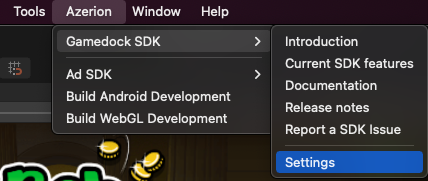
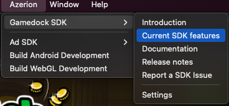
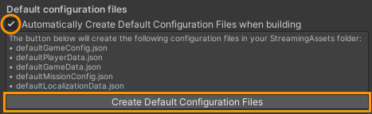
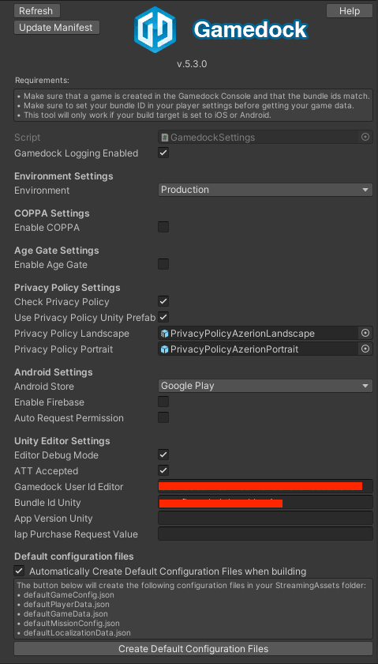
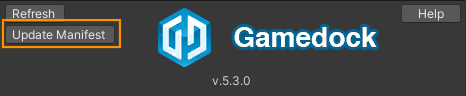
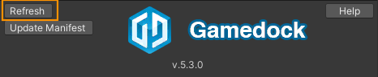

# Upgrade to Unity SDK 5.3.x

> [!WARNING]
> If current SDK version is below 5.2.0, first follow steps in : [Upgrade to Unity SDK 5.2.x](upgradeUnitySDK5.2.x.md) upto "Unity Editor inspection" section. Disregard "Unity Editor inspection" section completely. Continue from here if current version is 5.2.x.  

### Upgrade SDK via UPM

Update Packages/manifest.json to modify scope registries and sdk version:

~~~json
{
 "scopedRegistries": [
   ......
   {
     "name": "Azerion",
     "url": "http://registry.npmjs.com",
     "scopes": [
       "com.azerion",
       "com.azerion.gamedock-sdk-unity"
     ]
    },
    {
      "name": "package.openupm.com",
      "url": "https://package.openupm.com",
      "scopes": [
        "com.google.external-dependency-manager"
      ]
    }
   .......
 ],
 "dependencies": {
   .......
   "com.azerion.gamedock-sdk-unity": "5.3.x",
   "com.google.external-dependency-manager": "1.2.172",
   .......
 }
}
~~~

> [!NOTE]
> Use the latest Gamedock SDK version available here https://www.npmjs.com/package/com.azerion.gamedock-sdk-unity. 
External Dependency Manager is required by the Gamedock SDK.

### Remove existing Gamedock assets

Remove followings from the project:

* Assets/GamedockSDKiOSConfig.asset
* Assets/StreamingAssets/defaultGameConfigAndroid.json

### Remove GamedockSDK objects from the Scenes

Remove **Gamedock** component from the gameobjects within the scenes or just delete the "GamedockSDK" gameobjects if only the **Gamedock** script is attached to it and there are no child gameobjects attached. Make necessery adjustments if the child gameobjects need to be "DontDestroyOnLoad". Currently "GamedockSDK" gameobject is created runtime when initialized from the script.

### Getting Started with Gamedock Settings
All the Gamedock configurations/Settings are now managed via a single ScriptableObject named **GamedockSettings**. Configure Gamedock settings from **Azerion > Gamedock SDK > Settings**. It will create an asset file inside **Assets/Resources** directory. "Gamedock Settings" will appear in the Inspector, it's contents are very much similar to the properties that were available in previous Gamedock component.

### Current SDK Features 
Current SDK Features can be found from **Azerion > Gamedock SDK > Current SDK Features**.

<!-- panels:start -->
<!-- div:left-panel -->
### Using Gamedock Settings

#### 1. Platform related Configuration 
Most of the platform related settings required by Gamedock SDK are configured automatically when it creates GamedockSettings Serialized object. Make sure to set the Bundle identifier (iOS) and Package Name (Android) of your game in the Unity **Project Settings**.

#### 2. Gamedock Configuration 
In the Gamedock Settings setup Environment, COPPA, Age Gate, Privacy Policy, Native and Unity Settings as per your needs.
> [!NOTE]
> Age Gate and Privacy Policy unity prefabs can be found in *Packages/Gamedock SDK - Unity/Resources/Gamedock/*.

#### 3. Create default configuration files 
Make sure the fields are configured correctly and press the **Create default configuration files** button to retrieve the latest configurations for your game. This step is required before every build to make sure that the latest offline configs are included in the build. Check the **Automatically Create Default Configuration Files when building** if you want gamedock to perform this step automatically.  

The Gamedock SDK is now ready to use!

<!-- div:right-panel -->

<!-- panels:end -->

### Using GamedockSDK

Use following line to initialize/Start GamedockSDK:
~~~C#
Gamedock.MonoInstance.Initialize();
~~~
> [!NOTE]
> It is recommended to Initialize GamedockSDK inside **Start()** method.

You can subscribe to the event that notifies the initial initialization point completion. In order to register for the callback use the following code:
~~~C#
Gamedock.Instance.InitializationCallbacks.OnInitializationCompleted -= OnInitializationCompleted;
Gamedock.Instance.InitializationCallbacks.OnInitializationCompleted += OnInitializationCompleted;
~~~
> [!NOTE]
> Keep in mind that this does not signify that all the SDK modules are ready yet, and for individual functionalities you should still look at each features’ callbacks. Subscription must be done before GamedockSDK initialization. It is recommended to subscribe inside **OnEnable()** method and unsubscribe inside **OnDisable()**.

### Recommendations for Android Platform

It is recommended not to change any Gamedock SDK related settings manually in **mainTemplate.gradle** or main **AndroidManifest.xml** files. Gamedock SDK related settings in these two files are automatically managed by the **External Dependency Manager** and **Gamedock Settings**. If required, developers can manage these files manually using the templates provided with the package *(Located in Packages/Gamedock SDK - Unity/Plugins/Android/)*. **Update Manifest** button located in the **Gamedock Settings** can be used anytime to automaticaly configure main AndroidManifest based on Gamedock SDK requierments.

If developers make any change in the **mainTemplate.gradle** or **AndroidManifest.xml** when the Gamedock Settings panel is open in the Inspector, it is recommended to **Refresh** the Gamedock settings panel in the inspector to make Gamedock aware of the changes. Gamedock will try to fix these files automatically to prevent any potential issue.

